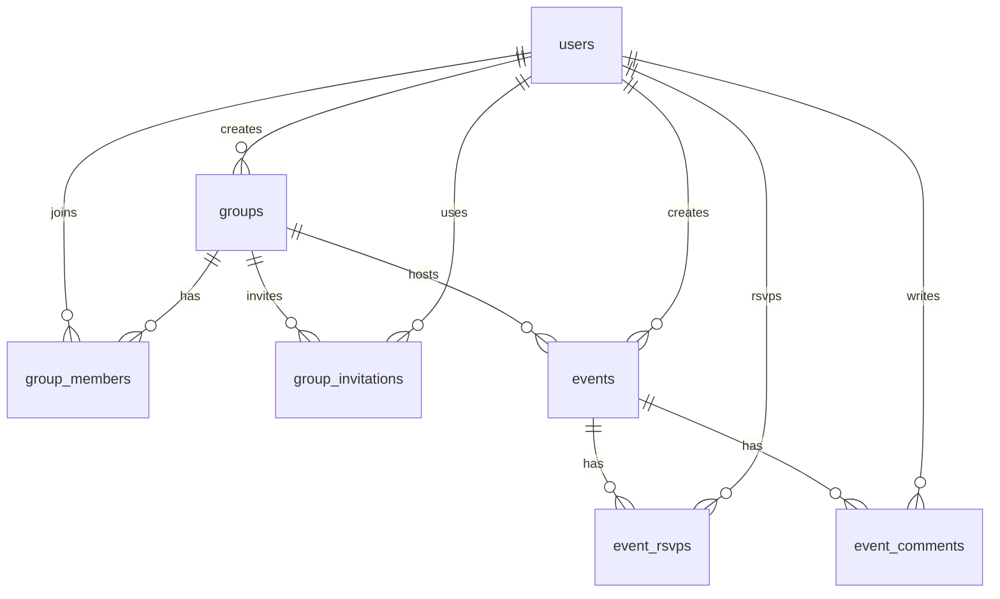

# Event Planner – Project Description

**Event Planner** is a multi-platform full-stack web and mobile application for friends, colleagues and communities to **plan and organize shared events** – parties, hikes, dinners, sports activities, cultural outings and more.

The app allows users to create **groups**, where events are organized and managed. Group managers announce events, and group members can RSVP, bring friends, leave comments and share event links with others.

---

## Who Can Do What

### Visitors
Anonymous users who visit the app website.
- View the public home page
- Register a new account (email + password)

### Registered Users
Users with a profile (name, email, optional photo) who can log in and out.
- Manage their own profile
- Create new groups (automatically becoming group manager)
- Join existing groups via an invitation link shared by a group manager

### Group Members
Registered users who have joined a group.
- Browse all events in their groups: upcoming, ongoing and past
- See the state of each event: **upcoming** | **ongoing** | **past**, with notes for canceled, full, under or over capacity
- RSVP to an event (going) or cancel their RSVP (not going)
- Reserve extra slots when joining (+1 / +2 / +3 friends)
- Post, edit and delete their own comments on events
- Share a direct link to any event

### Group Managers
Group members with elevated permissions to manage the group.
- Create, edit, cancel and delete events in their group
- Invite new members by generating and sharing an invite link
- Promote group members to manager or demote managers to regular members
- Remove members from the group

### Admins
Special platform-level users with full oversight.
- View and manage all users, groups and events via a dedicated admin panel

---

## Events

Each event belongs to a group and holds the following information:
- **Title** and **description**
- **Event type** (e.g. party, hike, dinner, sports, other)
- **Date**, **time** and **location**
- **Capacity** – maximum number of participants (default: 12)
- **Canceled** flag – set by a group manager if the event will not take place

### Event States
An event is always in one of three states, computed from its date and time:
- **Upcoming** – the start time has not yet been reached
- **Ongoing** – the event has started and less than 1 hour has passed
- **Past** – more than 1 hour has passed since the start time

An event is **open for RSVP** when it is upcoming or ongoing and has not been canceled. Members are not blocked from joining a full event – they decide among themselves how to handle over-capacity situations.

---

## Web App and Mobile App

### Web App (primary)
The full-featured application built with Next.js and React. Implements the entire platform: user management, group management, event management, RSVP, comments, invite links and admin panel.

### Mobile App (companion)
A scope-limited React Native / Expo app focused on the core member experience: login, register, browse events, RSVP to events, and comment on events.

---

## Technology Stack

| Layer | Technology |
|-------|-----------|
| Backend | Next.js (API routes + Server Actions) |
| Database | PostgreSQL – Neon DB (serverless) |
| ORM | Drizzle ORM |
| Frontend | Next.js + React + TypeScript + Tailwind CSS |
| Mobile | React Native + Expo |
| Auth | JWT tokens + bcrypt |
| File storage | Cloudflare R2 (user photos) |
| Deployment | Netlify (serverless) |

---

## Architecture Overview

- Next.js Web app provides UI plus server-side logic (Server Actions + API routes).
- Expo mobile app consumes the REST API exposed by the Web app.
- Business logic lives in a service layer consumed by both Server Actions and API routes.
- PostgreSQL (Neon) is accessed via Drizzle ORM and migrations.

---

## Repo Structure

```
event planner/
	AGENTS.md
	README.md
	package.json
	event-planner-web/
		src/
			app/            # Next.js UI + API routes
			services/       # Business logic layer
			db/             # Drizzle schema + seeds
		drizzle/          # Migrations
		README.md
	event-planner-mobile/
		src/              # Expo app source
		README.md
	event-planner-shared/
		src/              # Shared types/utilities
```

---

## Database Schema (High Level)



---

## Local Development Setup

### Prerequisites
- Node.js 18+
- PostgreSQL database (Neon recommended)

### Environment Variables

Create the following files:

`event-planner-web/.env`

```
DATABASE_URL=postgresql://<user>:<pass>@<host>/<db>?sslmode=require
JWT_SECRET=<random_secret_min_32_chars>
```

`event-planner-mobile/.env`

```
EXPO_PUBLIC_API_BASE_URL=http://localhost:3000/api
```

### Install and Run

From the repo root:

```
npm install
npm run dev
```

Alternative: run apps separately

```
npm run dev -w event-planner-web
npm run start -w event-planner-mobile
```

### Database Migrations and Seed

```
npm run db:migrate -w event-planner-web
npm run db:seed -w event-planner-web
```

---

## Key Folders and Files

- `event-planner-web/src/app`: Next.js routes, pages, and API endpoints.
- `event-planner-web/src/services`: Business logic for groups, events, RSVP, comments.
- `event-planner-web/src/db`: Drizzle schema, DB helpers, and seed script.
- `event-planner-web/drizzle`: Drizzle migrations.
- `event-planner-mobile/src`: Expo mobile app screens and components.
- `event-planner-shared/src`: Shared types and utilities across web/mobile.

---

## Sample Credentials

| Role | Email | Password |
|------|-------|----------|
| Admin | admin@demo.com | demo123 |
| Group Manager | manager@demo.com | demo123 |
| Group Member | member@demo.com | demo123 |