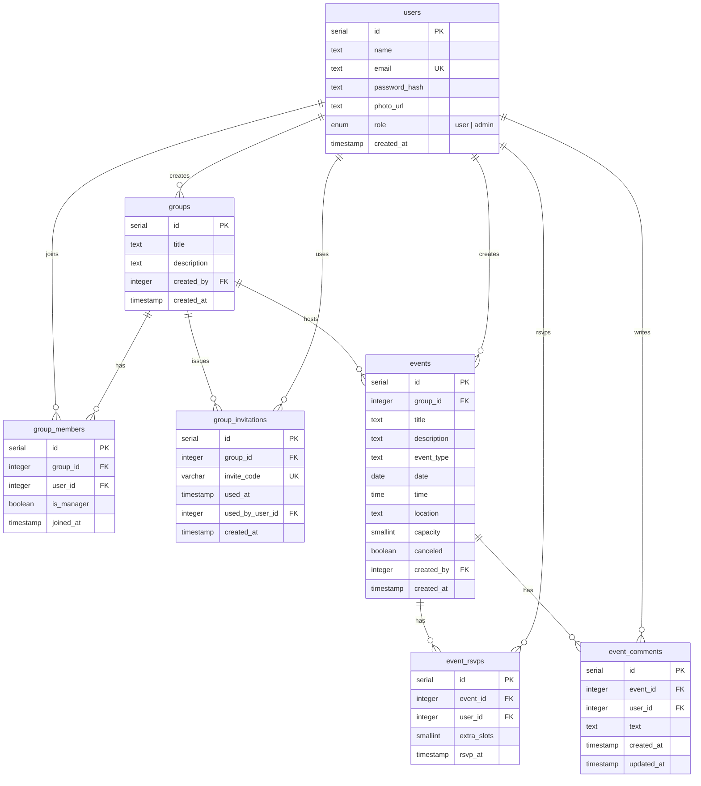

# Database Schema

The Event Planner uses **7 PostgreSQL tables** managed through Drizzle ORM and
Drizzle Kit migrations. The schema source of truth is
[`event-planner-web/src/db/schema.ts`](../event-planner-web/src/db/schema.ts).

## Entity-Relationship Diagram



## Tables

### `users`
Account record. `role` is a Postgres enum (`user_role`) with values `user | admin`.
Email is unique (`users_email_unique`).

### `groups`
A community of users. Created by a user (`created_by`). Indexed on `created_by`.

### `group_members`
Many-to-many between `users` and `groups`. `is_manager` elevates a member to
group manager. Composite uniqueness on `(group_id, user_id)`; indexed on both
foreign keys.

### `group_invitations`
Short invite codes used to join a group. `invite_code` is globally unique.
Partial index on active (unused) invites.

### `events`
Belongs to a `group`. `date` and `time` are stored separately so we can compute
event state at query time:

- **upcoming** — start time in the future
- **ongoing** — started, < 1h elapsed
- **past** — > 1h elapsed

`canceled` is a flag. `capacity` has a CHECK constraint `>= 0`. Indexes on
`group_id`, `created_by`, `(date, time)`, and `canceled`.

### `event_rsvps`
RSVP record. `extra_slots` is the number of guests the user brings (0–1000,
enforced by CHECK). Composite uniqueness on `(event_id, user_id)`.

### `event_comments`
Comments on an event. Indexed on `event_id`, `user_id`, and `created_at` for
chronological listing and per-event queries.

## Indexes

All foreign keys and frequently filtered columns are indexed. See
`schema.ts` for the full list — Drizzle generates them as part of the
migration in `drizzle/0000_*.sql`.

## Migrations

```bash
# Edit src/db/schema.ts, then:
npm run db:generate -w event-planner-web   # generates SQL in drizzle/
npm run db:migrate  -w event-planner-web   # applies to DATABASE_URL
```

Migration SQL files are committed in `event-planner-web/drizzle/`.
